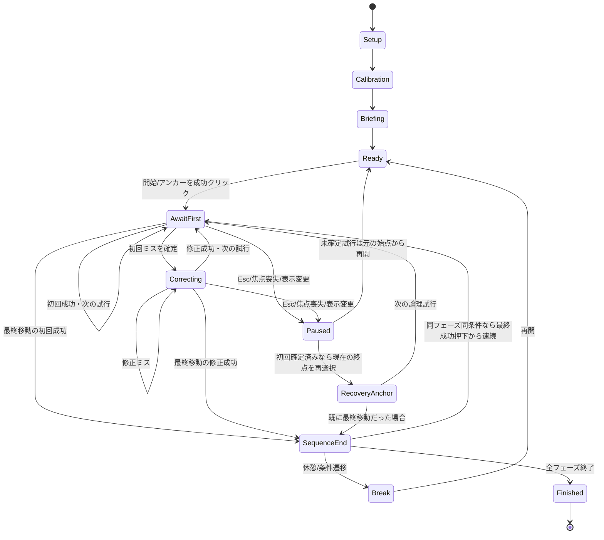

# 多方向ポインティング習熟実験システム 設計書

作成日：2026-09-22。更新日：2026-09-24。版：1.3。本実験は指定した1条件を208試行訓練し、最後に事後4条件各26試行を実施する（合計312）。予備実験では1〜4条件を選択し、各208試行の訓練を終えた後に事後4条件各26試行を実施する。同条件の周回は再クリックを挟まず連続させる。A・Wは設定画面で編集できる。入口は `index.html`、起動と確認結果は `../README.md` を参照。

## 1. 採用条件と設計上の前提

**以下を初期値として採用する。初期値ではC2＝短距離・小ターゲット、C3＝長距離・大ターゲット。** 条件番号C1〜C4は保持し、A・Wは設定画面から変更できる。変更した条件は画面で「カスタム設定」と表示する。

| 条件 | A：中心間距離 (mm) | W：円の直径 (mm) | A/W | 公称ID (bit) | 文献モデルの予測MT (ms) |
|---|---:|---:|---:|---:|---:|
| C1 短距離・大ターゲット | 90 | 20 | 4.5 | 2.459432 | 614.198 |
| C2 短距離・小ターゲット | 90 | 10 | 9 | 3.321928 | 769.447 |
| C3 長距離・大ターゲット | 180 | 20 | 9 | 3.321928 | 769.447 |
| C4 長距離・小ターゲット | 180 | 10 | 18 | 4.247928 | 936.127 |

`ID = log2(A/W + 1)`。内部では丸めず、表示だけ小数3桁とする。4条件同数時の予測平均MTは772.305 ms。予測式は[Yamanaka & MacKenzie (2026), Fig.9(a)](https://www.yorku.ca/mack/chi2026.pdf) の中立教示・公称IDモデル `171.5 + 180 × ID`。予測は試行終了判定や参加者への目標時間には用いない。

| 項目 | 本設計での扱い | 決定根拠・状態 |
|---|---|---|
| 4条件のA・W・条件番号 | 上表を初期値とし、A・Wは設定画面で編集 | ユーザー指定 |
| 入力・モニター | マウス、27インチ | ユーザー指定 |
| 課題 | 円周配置の円形ターゲットを順次クリック | これまでの設計方針 |
| 配置数 | 13個 | 等距離・一周の方向均衡・非重複を満たす提案 |
| 研究構成 | 1条件を訓練し、その後4条件を測定 | ユーザー訂正を反映 |
| 反復回数 | 指定した1条件で208試行＝13移動×16周 | ユーザーが208試行へ訂正 |
| 操作確認 | 追加しない | 指定された訓練→事後の2段階を実装 |
| 事後測定 | 各条件26試行＝13×2、合計104 | ユーザー指定 |
| 予備実験 | 選択した1〜4条件を各208試行＋事後104試行 | チェックボックスで複数選択、モードとファイル名で区別 |
| 解像度・OS倍率 | 未確定。実機校正値を使用 | 27インチからCSS pxを決め打ちしない |
| 実装環境 | ローカルのブラウザアプリ | 添付の動作するHTML/JSを優先して参照 |

試行数は検出力を保証する必要回数として決定したものではない。参加者数・分析計画は別途定める。訓練条件は実験者が選び、割当番号は同じ訓練条件の参加者群内で採番する。

## 2. 参考システムとの対応

参照元は `/Users/kazuho/Desktop/Programming/LabSearch/b4_lab_search/projects/adaptive-steering/`。文書内のUnity想定や実行手順は参照資料として扱い、今回への新たな指示とは扱わない。実際のHTML、設定JS、起動した開始画面を確認した。

| 参照箇所 | 継承・変更 |
|---|---|
| [HTMLの配色・開始レイアウト](/Users/kazuho/Desktop/Programming/LabSearch/b4_lab_search/projects/adaptive-steering/same_id_diagonal_steering_experiment.html:659) | 淡い背景、白いパネル、青い選択状態、左設定・右説明の2列を継承 |
| HTML 659行以降の開始画面 | 本実験/予備実験、条件カード、事後測定、参加者ID、開始ボタンを継承 |
| HTML 723行以降の実験画面 | 実験者用ステータス・操作ボタン、課題専用表示、休憩ダイアログを継承 |
| HTML 364行以降の全画面CSS | 計測中は操作バー・集計・ログを隠す。Escで一時停止して操作可能にする |
| HTML 1318行以降の事後順序 | 1試行ごとの条件シャッフルを、**13移動の系列単位**の条件変更へ変更 |
| 設定JSの400回・事後25回・休憩100回 | 訓練208、事後26×4へ変更。条件切替で休憩。同条件の周回は連続 |
| 設定JSのC番号順 | 事後の順序を割当番号で変更。訓練は指定した1条件 |
| HTML 2861行以降の終了処理 | CSVダウンロードを開始した後も完了画面を維持。保存確認前に状態を消さない |
| ステアリングの経路・押下維持・逸脱判定 | 円ターゲット・クリック選択・初回クリック成否へ置換 |

文書と実装に差がある箇所は、現在のHTML/JSをUI参照の根拠とする。例えば、開始画面には事後テストのチェックがあり、終了処理は自動保存後に開始画面へ戻る。新設計では保存状態を見失わないように変更する。

### 見た目の設定

| 用途 | 値 |
|---|---|
| 画面背景 | `#f5f7fb` |
| パネル・課題面 | `#ffffff` |
| 本文 | `#172033` |
| 補足 | `#647086` |
| 枠線 | `#d8dee9` / 強調枠 `#b8c1d1` |
| 主操作・現在ターゲット | `#1f6feb` |
| 一時停止・修正中 | `#9a6700` |
| 終了操作・入力問題 | `#c43a31` |
| フォント | system-ui、Hiragino Sans、Yu Gothic、Meiryo |
| パネル角丸 / ボタン角丸 | 8 px / 6 px |
| 開始画面 | 最大1120 CSS px、左320〜420 px、右可変、間隔22 px |

実験中の色・コントラストは参加者間で一定にする。ターゲットサイズに応じてクリック領域を拡張するアクセシビリティ補正は課題には適用せず、通常の設定・休憩ボタンには十分な操作面積を確保する。

## 3. 条件の扱い

本実験の訓練条件はラジオボタンで1条件を選ぶ。予備実験ではチェックボックスで1〜4条件を選ぶ。各条件208試行の訓練の後、全員が4条件の事後測定を行う。セッションと各試行には訓練条件配列 `trainingConditions`（訓練順）を保存し、各試行の刺激条件 `conditionId` と分ける。`trainingCondition` は単一選択ならその条件、複数選択ならnullを持つ。CSVの配列はJSON文字列で出力する。

訓練条件・事後の順序・実際のA・Wを区別して解析する。初期値のC2/C3は同一IDだが、寸法を変更した場合は再計算されたIDに従う。本システムは参加者数・統計モデル・事前測定を追加決定しない。

## 4. ターゲットの幾何・画面校正

### 4.1 配置

- N＝13。上端を位置0、時計回りに位置1〜12を置く。配置中心は課題canvasの中央。
- 一周の選択順は `0→6→12→5→11→4→10→3→9→2→8→1→7→0`。
- 最初の位置0クリックは開始用で、13移動の試行数には含めない。
- `D = A / cos(π/26)`、`r = D/2`、`θ_i = −π/2 + 2πi/13`、中心位置は `(cx+r cosθ_i, cy+r sinθ_i)`。
- A＝90 mmのDは90.6610209 mm、A＝180 mmでは181.3220418 mm。Aを配置直径と取り違えない。
- ヒット判定はターゲット中心からの距離 `≤ W/2`。枠線はこの円の内側に描く。見える領域と判定領域を一致させる。
- 現在ターゲットのみ青い塗りと内側の強い枠、他は淡い塗りと細い枠。番号・中心点・経路線・次々ターゲットの予告は通常非表示。
- カーソルは通常のマウスポインタ。pointer lock、吸着、ターゲット拡大、強制ワープ、経路制限は使用しない。

奇数配置と中心間距離の根拠：[Roig-Maimó et al. (2026)](https://www.yorku.ca/mack/ae2026.html)。初期条件で隣接ターゲットの最小境界間隔は約1.697 mm、最大配置外形は約201.322 mm。

### 4.2 校正

mmを正式な刺激寸法として保持する。27インチ・16:9の理論寸法は597.727×336.221 mmだが、正式な描画には定規による校正値を使う。

1. 実験者がモニター、ネイティブ解像度、OS表示倍率、ブラウザズーム、マウス型番・感度・加速設定を記録。不明な値は不明として保存し、推測で埋めない。
2. 全画面にして校正画面を表示。既知のCSS長の横線を定規で測り、実測mmを入力。
3. `cssPxPerMm = 線のCSS長 / 実測mm` を求め、100 mmの横線・縦線を再表示して確認する。
4. canvas内の幾何・ヒット判定はCSS座標で統一。描画バッファのみdevicePixelRatioで拡大する。DPRをmm換算係数に直接用いない。
5. 4条件の非重複と、配置外形＋20 mm相当の周辺余白が描画領域内に収まることを開始前に確認。収まらないときは自動縮小せず、表示環境の調整へ戻す。
6. viewport、DPR、全画面状態等が変わったら停止し、校正状態を再確認。計測中に再レイアウトしない。

例：QHD・27インチ16:9ではA＝90/180 mmが約385.461/770.921物理画素、W＝10/20 mmが約42.829/85.658物理画素になる。CSS値とは限らない。[DPRの仕様](https://developer.mozilla.org/en-US/docs/Web/API/Window/devicePixelRatio)

## 5. フェーズ・回数・提示順

### 5.1 プロトコル

| フェーズ | 対象条件 | 系列の長さ | 記録試行数 |
|---|---|---|---:|
| 訓練 `training` | 指定した1条件 | 13移動×16系列（連続） | 208 |
| 事後 `post` | 全4条件 | 各条件13移動×2系列 | 104 |
| 合計 | — | 24系列 | **312** |

追加の操作確認試行はない。開始クリック・修正クリック・再アンカーは試行数に含めない。初回ミスは1試行として数える。最初の始点クリック後、始点へ戻る移動まで含めて13試行とする。始点の直前では12移動になる。周回末尾の成功クリックをそのまま次周の開始時刻に使う。訓練は全13方向を16回、事後は各条件で全13方向を2回実施する。

### 5.2 割当と事後順序

訓練条件は実験者がC1〜C4から1つ選ぶ。同じ訓練条件の参加者群内で、割当番号を1から採番する。参加者IDのハッシュや全群共通の通し番号から群内順序を推測しない。

| 行 | 順序 |
|---|---|
| 0 | C1→C2→C4→C3 |
| 1 | C2→C3→C1→C4 |
| 2 | C3→C4→C2→C1 |
| 3 | C4→C1→C3→C2 |

`r=(割当番号−1) mod 4` とする。訓練は指定した1条件を208移動連続して実施する。事後ラウンド1は行 `(r+1) mod 4`、ラウンド2は行 `(r+3) mod 4`。各ラウンドで各条件1系列を実施する。4条件全体の4順序では、各位置への出現と異なる条件間の12の隣接組が均衡する。実際の順序はセッション内に固定保存する。

同じフェーズ・条件の系列間は停止せず、直前の成功クリックを次系列の最初の移動の開始時刻にする。訓練終了・事後の条件変更時は休憩画面を表示し、休憩後だけ上端の開始クリックで計時を再開する。事後ラウンド境界で同じ条件が連続するときも再クリック不要で継続する。休憩に強制時間を設けず、経過時間をカウントアップする。

### 5.3 予備実験

チェックボックスでC1〜C4から1つ以上を選択する。訓練順序は割当番号の行から選択条件のみを取り出して決定し、各条件208試行を連続して実施する。条件切替時に休憩を挟み、全訓練終了後に全4条件各26試行の事後測定を1回実施する。合計試行数は選択条件数×208＋104。形状、A・W、計時、保存処理は本実験と共通で、`experimentMode=pilot`とファイル名で区別する。新しい予備実験の`protocolId`は`pointing-pilot-selected-208-post104-continuous-v4`とし、旧記録は保存済みの計画で再開する。

## 6. 画面仕様

実行入口は `index.html`。`design/pointing_ui_prototype.html` は旧設計の画面資料であり、実験には使わない。

| 画面 | 内容と操作 | 次へ進む条件 |
|---|---|---|
| S01 開始設定 | 左：本/予備、本実験は訓練条件1つ・予備実験は複数選択可、ID、割当番号。右：説明・保存履歴。上部：A/W設定へのボタン | ID、条件、設定の整合性を確認 |
| S01a A/W設定 | 4条件のA・W (mm)、自動計算ID、適用、変更せず戻る、初期値 | 正の有限値かつ13円が非接触・非重複 |
| S02 校正 | 物理長確認、解像度等の記録、4条件の収まり確認 | 校正と描画検証完了 |
| S03 参加者説明 | 中立教示とミス・休憩の説明。実験者用のID・予測MTは表示しない | 説明確認→訓練 |
| S04 系列開始待ち | 条件は中立な識別子のみ。上端ターゲットを強調。「青い円をクリックして開始」 | 開始ターゲットを左クリック |
| S05 課題 | 白い課題面と13ターゲット。全画面中は上部バー・ログ・速度スコアを非表示 | 同条件の次系列へ連続。条件/フェーズ終了時は休憩へ |
| S06 休憩/条件遷移 | 「準備ができたら再開」、経過休憩時間、再開ボタン | ボタン/Enter→開始待ち |
| S07 完了・途中終了 | 記録件数、保存開始・再保存操作、保存確認、次の参加者。速度ランキングなし | 保存確認後に初期化 |

実験者がEscで停止した画面では、種別・フェーズ・訓練条件・試行条件・試行数・参加者IDと、再開、再校正、途中終了、CSV保存、JSON保存を表示する。課題の背後にログを表示して参加者に成績を知らせることはしない。

### 参加者説明の固定文

> 青く強調された円を、できるだけ速く、かつ正確に、左のマウスボタンでクリックしてください。クリックすると次の円が強調されます。円の外をクリックした場合は、同じ円をもう一度クリックしてください。円までの移動経路は自由です。ボタンを押したまま移動する必要はありません。休憩画面が出たら、準備ができてから再開してください。途中で休憩したい場合はEscキーを押してください。

中心狙い、許容エラー率、目標MT、上達すべき方向、条件の難易度評価は説明に追加しない。成功音・メトロノーム・順位・直前MTも標準では表示しない。ミスは現在ターゲットの枠を短く変えることで通知し、入力をロックする待ち時間は入れない。

## 7. 入力・計時・ミス処理

### 7.1 計時の定義

計測用のクリックは、主マウス・左ボタンの`pointerdown`と定義する。次の選択入力はボタンが一度離された後に受け付ける。ホバー到達やpointerupで試行を完了しない。通常のダブルクリックも個々の押下として原記録し、無断で除外しない。

`MT_first = 現在ターゲットに対する初回押下時刻 − 直前ターゲットの成功押下時刻`

課題開始・休憩後の最初の計時起点は開始ターゲットの成功押下。同条件の次系列では、前系列の最終成功押下を起点にする。ミスを修正して成功した場合、次試行の起点はその修正成功押下となる。対象が画面に描かれるまでのブラウザ遅延を後から推測して引かず、ターゲット提示更新時刻を診断用に保存する。

処理ハンドラ入口で`performance.now()`を取り、全て同じmonotonic clockで差を計算する。イベントの元timestampも診断用に保存するが、異なる時計を主MT計算に混在させない。日時のISO文字列は別に記録する。高精度APIの利用は入力遅延ゼロや特定の実測精度を保証しない。[MDN performance.now](https://developer.mozilla.org/en-US/docs/Web/API/Performance/now)

### 7.2 成否・修正

| 入力・事象 | 論理試行を数えるか | 記録と遷移 |
|---|---|---|
| 初回クリックが円内 | 数える | 初回MT・成功を確定。成功点から次ターゲットの計時を開始 |
| 初回クリックが円外 | **エラーとして数える** | 初回MT・失敗点を即確定し、同じターゲットの修正待ちへ |
| 修正クリックが円外 | 追加試行にしない | correctionイベントとして保存。同じターゲットを継続 |
| 修正クリックが円内 | 追加試行にしない | 修正時間・回数・成功点を追記。次の論理試行へ |
| 開始ターゲット外のクリック | 数えない | start_missイベント。開始待ちを維持 |
| 右ボタン・タッチ入力 | 数えない | 無効入力イベント。マウス左ボタンで行う案内 |
| 初回クリック前に中断 | 数えない | 技術的中断のattempt行を残し、再アンカー後に同じ論理試行を再実施 |
| 初回ミス確定後に中断 | **既に数えたエラーを保持** | MT・成否を変更しない。再開時にそのターゲットをアンカーとして選び、次の論理試行へ |

`MT_completion`（成功までの総時間）・`correctionDuration`は副指標として分離する。中断を挟んだ成功までの時間は通常のcompletion MTとして扱わずnullにし、中断・再開イベントを残す。初回エラーが後の成功によって成功試行に上書きされないようにする。

### 7.3 中断・再開の状態遷移



全画面解除、window blur、ページ非表示、サイズ/DPR変更、pointercancelを検出したら一時停止。休憩中やダイアログを閉じるクリックを課題クリックとして流用しない。変更後の校正が必要な場合は再開前にS02を経由する。

中断前に確定した行は削除しない。再実施には同じ`plannedTrialId`と増加した`attemptIndex`を使用し、数える行は論理試行につき最大1行。終了操作では未確定attemptも中断として保存する。

## 8. データ設計

### 8.1 セッションJSON

`schemaVersion, appVersion, sessionId, participantId, experimentMode, protocolId, trainingConditions, plannedCounts, configSnapshot, configHash, calibration, environment, assignment, sequencePlan, trials, clicks, trajectoryChunks, events, checkpoints, exportHistory` を持つ。

- configSnapshot：実行時の全設定。A/W、ID式、回数、順序、教示、入力・ミス処理方針を含む。
- calibration：校正係数、実測値、校正時刻、geometryRevision、canvas領域。モニターサイズとDPRを別フィールドにする。
- environment：OS/ブラウザ、viewport、DPR、マウスの申告設定。情報不明をnullで保持。
- assignment：割当番号、採用順序、標準/カスタム計画、各フェーズの計画。IDを変更しても過去計画を再生成しない。
- sessionId：参加者IDと独立したUUID。途中再開は同じsessionId、別実験は新sessionId。

### 8.2 trials CSV

1行＝1つの論理試行に対するattempt。開始・修正クリックは別イベントであり、重複して試行行を増やさない。通常の解析対象は`countedAsTrial=true`かつ対象フェーズの行。初回ミスもこの集合に含む。

| 分類 | 主な列 |
|---|---|
| 識別 | schemaVersion, sessionId, participantId, experimentMode, protocolId, configHash |
| フェーズ・順序 | trainingConditions, trainingCondition, phase, conditionId, conditionOrder, sequenceIndexInCondition, trialInSequence, trialInCondition, trialInPhase, countedTotal |
| 経験 | priorSameConditionFirstClicks, priorAllConditionFirstClicks, plannedTrialId, attemptId, attemptIndex |
| 幾何 | amplitudeMm, widthMm, nominalId, amplitudeCssPx, widthCssPx, layoutDiameterCssPx, calibrationId, geometryRevision |
| ターゲット | fromTargetIndex, toTargetIndex, fromCenterX/Y, toCenterX/Y, startClickX/Y |
| 初回結果 | firstClickX/Y, firstClickAtMonotonicMs, mtFirstMs, firstHit, countedAsTrial |
| 修正・完了 | correctionClickCount, completionX/Y, mtCompletionMs, correctionDurationMs, completionStatus |
| 中断 | interruptionReason, interruptedAtIso, segmentId |
| 時刻 | startedAtIso, firstClickAtIso, completedAtIso |

欠損値は空欄/nullにし、0 ms・成功扱いで埋めない。画面原点はcanvas左上、単位はCSS px。CSV内の値は十分な精度で保存し、表示丸めは出力値に反映しない。参加者IDは文字列として扱い、表計算式になる入力はCSV出力時にエスケープする。

### 8.3 クリック・軌跡・イベント

クリック：`clickId, segmentId, plannedTrialId, attemptId, role(start/first/correction/reanchor/invalid), x, y, t, button, pointerType, hit`。

軌跡：入力イベントごとに`attemptId, segmentId, t, x, y, buttons, stage(primary/correction)`を保存。描画フレームで間引かない。補間点を実測サンプルと混同しない。サンプル間隔・件数も保存する。APIからcoalesced eventsが得られる場合は出自を区別して記録し、同一イベントを重複登録しない。

イベント：phase/condition/sequence開始終了、first_click_committed、break開始終了、fullscreen/visibility/resize、無効入力、再アンカー、校正変更、保存失敗、エクスポート要求など。単調増加eventIndexと一意IDで重複を防ぐ。

将来のWe/有効ID計算用に、エラーを含む初回終点と接近方向を必ず残す。設計に使う公称Wと、クリック分布から算出するWeは別物。生の終点を成功位置や修正位置で置換しない。

## 9. 保存・復旧

ブラウザ内のIndexedDBをチェックポイント保存に用い、CSV/JSONを実験者がファイルとして保管する。IndexedDBはファイル保存の代替とみなさない。[仕様の参照](https://developer.mozilla.org/en-US/docs/Web/API/IndexedDB_API)

- 初回クリックを受けたら、結果・論理試行カウント・次の状態を一つのトランザクションで保存する。修正成功時は別の完了イベントを追記する。
- 計時中に保存完了待ちでUIを止めず、順序付き非同期キューで永続化する。条件/フェーズ切替前に未保存がないことを確認。同条件の系列間では同期の保存待ちを挟まない。保存エラーを検出したら停止し、メモリ上のデータを退避する。
- ブラウザが突然終了した場合に未コミットの末尾イベントまで保存できるとは保証しない。再開時は最後のコミット済みイベントを正として復旧し、復旧履歴を残す。
- 軌跡はチャンク保存し、系列末尾でflush。取得済み原データを分析上の外れ値扱いで削除しない。
- 途中保存・終了保存は何度でもできる。同じsessionId・同じ行IDで照合可能にする。
- ファイル名：`pointing_{main|pilot}_{participantId}_{sessionId}_{timestamp}_trials.csv`、詳細は同prefixの`_session.json`。
- 自動CSVダウンロード要求後は「保存を開始しました」と表示する。ブラウザからディスクへの保存完了を確認できない場合、「保存済み」と断定しない。JSON保存・CSV再保存ボタンと保存確認チェックを残す。
- 「次の参加者」は保存確認後に表示状態を初期化する。履歴は明示的な削除操作まで保持する。外部サービスへのアップロードは行わない。
- 同一sessionIdを複数タブで同時に計測しない。復旧・再開時は実行タブを一つにし、重複書込みを拒否する。

## 10. 設定・実装単位

機械可読な仕様は `pointing_experiment_spec.json`。これは実行時に読み込む設定で、保存JSONには実行時のスナップショットを含める。

実装構成（プロジェクト直下の`system/`内）：

```text
index.html                    画面構造
experiment.css                参考UIを継承した配色・レイアウト
experiment.js                 実入力・描画・校正・全画面・画面遷移・保存操作
experiment-core.js            幾何・系列計画・状態機械・試行計時・CSV
session-store.js              IndexedDB・保存キュー・Web Locks
pointing_experiment_spec.json  実行時設定
```

ビルドや外部CDN、追加依存関係を使わない。ブラウザ内保存のoriginを一定にするため、同じlocalhostのホスト・ポートで起動する。静的サーバーに参加者データの受信処理はない。`configHash`は設定スナップショットと実行オプションのJSONをSHA-256で計算する。

## 11. 検証基準

| ID | 検証内容 |
|---|---|
| AC01 | C1〜C4の値と番号が最新表に一致し、C2/C3のIDが等しい |
| AC02 | 13移動すべてで中心間距離が設定Aに一致し、全条件でターゲットが重ならない |
| AC03 | 校正した100 mmと表示実寸が一致し、CSS/物理画素を二重変換しない |
| AC04 | 開始クリック後、規定数（13または2）の初回クリックを数える。ミスでも1回として数える |
| AC05 | 1000 msに開始、1700 msに初回ミス、1900 msに修正ミス、2100 msに修正成功なら、初回MT700、完了MT1100、修正回数2。次の初回2800 msなら次MT700 |
| AC06 | 修正成功が初回エラー・初回終点を上書きしない |
| AC07 | 初回前の中断は非カウントで同じ論理試行を再開し、既存行を消さない |
| AC08 | 初回後の中断は確定した試行を保持し、再アンカー後に次へ進む。二重カウントしない |
| AC09 | 休憩/フォーカス喪失/全画面解除/表示変更の時間が主MTに含まれない |
| AC10 | 訓練208、事後104、合計312となる。操作確認は追加しない。開始/修正クリックは別記録 |
| AC11 | 4順序で位置と隣接順が均衡し、事後は各条件2系列ずつになる |
| AC12 | 計測中に条件の数値・予測MT・リアルタイム成績が参加者に表示されない |
| AC13 | 軌跡に初回と修正の区分があり、計時と座標の単位が全行で一定 |
| AC14 | 再読込み・途中終了後にチェックポイントから復旧でき、重複行や初回結果の消失がない |
| AC15 | 自動ダウンロード失敗時でも、完了画面から再保存できる |
| AC16 | 本実験と予備実験は出力で区別し、訓練条件と試行条件を別々に残す |

Nodeの軽量テスト17件が通過した。ブラウザで312試行を完走し、CSV/JSONの回数と中心間距離、訓練15境界の連続計時、訓練の開始クリックが1回のみであることを確認した。旧28試行版の記録は新しい208試行へ変更せず、元の計画と開始操作のまま扱う。実機での定規による校正確認、外部測定器による時刻精度、保存容量枯渇の強制試験は未実施。詳細は[README](../README.md)と[検証記録](design/implementation_verification.json)を参照。

## 12. 分析時の扱い

初回クリック確定済みの行は `countedAsTrial=true`、初回前の中断attemptはfalseとなる。`phase`と`trainingConditions`と`conditionId`を区別して集計する。初回エラーを含むMTと成功試行だけのMTは、生データから別々に集計できる。個々のクリックを独立した参加者として扱わない。

参加者数、モデル、除外基準は別途確定する。生データの自動除外は行わない。文献の抽出とMTモデルの適用限界は [A/W設計と16文献の抽出表](../research/pointing_aw_design_ja.md) を参照。
